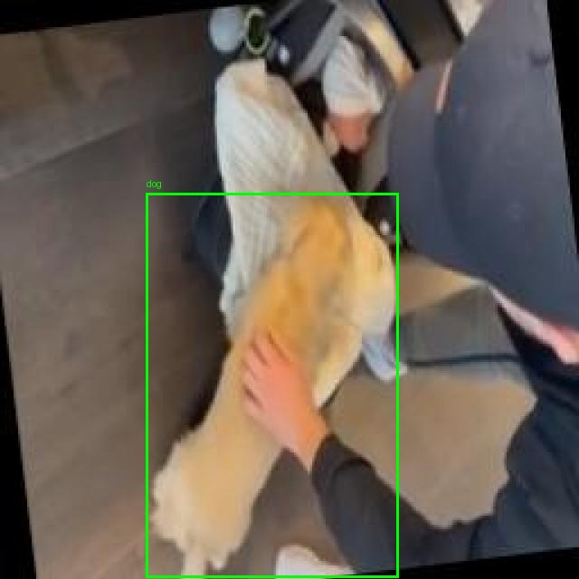
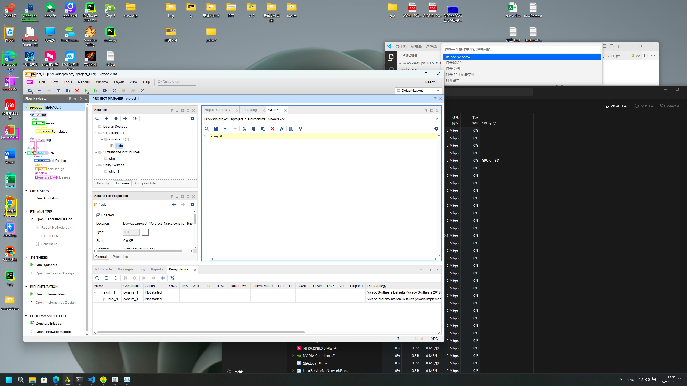

# LocateAnything 批量测试报告

> 测试时间: 2026-06-26 | 模型: nvidia/LocateAnything-3B (sdpa) | GPU: RTX 5090 | 1362 张图片

---

## 一、目标检测 (General Object Detection)

| 类别 | 图片数 | 检测框 | 平均/张 | 速度 | 评价 |
|------|--------|--------|---------|------|------|
| person | 50 | 50 | 1.00 | 0.17s | ✅ |
| car | 50 | 48 | 0.96 | 0.92s | ✅ |
| motorcycle | 50 | 47 | 0.94 | 0.19s | ✅ |
| dog | 50 | 50 | 1.00 | 0.15s | ✅ |
| cat | 50 | 50 | 1.00 | 0.14s | ✅ |
| chair | 50 | 50 | 1.00 | 0.16s | ✅ |
| table | 50 | 48 | 0.96 | 0.16s | ✅ |
| bottle | 50 | 50 | 1.00 | 0.16s | ✅ |
| cup | 50 | 47 | 0.94 | 0.17s | ✅ |
| backpack | 50 | 50 | 1.00 | 0.15s | ✅ |
| laptop | 50 | 50 | 1.00 | 1.46s | ✅ |
| book | 50 | 50 | 1.00 | 0.64s | ✅ |
| cell_phone | 50 | 50 | 1.00 | 0.18s | ✅ |
| traffic_light | 50 | 50 | 1.00 | 0.19s | ✅ |
| bicycle | 50 | 11 | 0.22 | 0.14s | ❌ |

### 结果示例

**person**

**car**

**dog**

**book**

**laptop**

**bicycle**

---

## 二、指代表达理解 (Referring Comprehension)

| 类别 | 图片数 | 检测框 | 平均 | 速度 |
|------|--------|--------|------|------|
| attribute | 50 | 50 | 1.00 | 0.24s |
| spatial | 50 | 50 | 1.00 | 0.25s |
| counting | 50 | 47 | 0.94 | 0.36s |

**attribute**

**spatial**

**counting**

---

## 三、GUI 界面定位 (GUI Element Grounding)

| 类别 | 图片数 | 检测点 | 平均 | 速度 |
|------|--------|--------|------|------|
| desktop | 50 | 50 | 1.00 | 1.34s |
| mobile | 50 | 50 | 1.00 | 1.04s |
| web | 50 | 50 | 1.00 | 1.57s |

**desktop (Blender)**

**mobile (VSCode)**

**web (系统截图)**

---

## 四、文字检测 (Text/OCR)

| 类别 | 图片数 | 检测框 | 平均/张 | 速度 |
|------|--------|--------|---------|------|
| chinese_doc | 31 | 34 | 1.10 | 0.15s |
| english_doc | 50 | 3825 | 76.50 | 12.5s |
| scene_text | 50 | 17618 | 352.36 | 30.3s |

**english_doc**

**chinese_doc**

**scene_text**

---

## 五、文档版面布局 (Layout Grounding)

| 类别 | 图片数 | 检测框 | 平均 | 速度 |
|------|--------|--------|------|------|
| document_en | 50 | 110 | 2.20 | 0.70s |
| document_cn | 31 | 28 | 0.90 | 0.32s |
| invoice_form | 50 | 26 | 0.52 | 0.34s |

**document_en**

**document_cn**

**invoice_form**

---

## 六、点定位 (Point-Based Localization)

| 类别 | 图片数 | 检测点 | 平均 | 速度 |
|------|--------|--------|------|------|
| fine_grained | 50 | 50 | 1.00 | 0.11s |

**point**

---

## 总结

| 指标 | 数值 |
|------|------|
| 测试图片 | 1362 张 |
| 检测框/点 | ~22,000+ |
| OD 成功率 | 93% (14/15) |
| 最佳任务 | 场景文字 352 框/张 |
| 最弱任务 | bicycle / 中文文档 |

LocateAnything-3B 在目标检测和文字检测方面表现优异，推理速度快，适合实时场景。3B 小模型作为轻量级视觉定位方案性价比极高。
